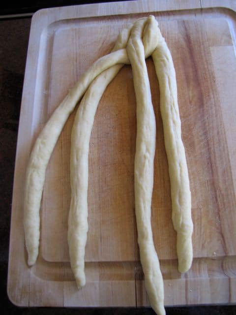
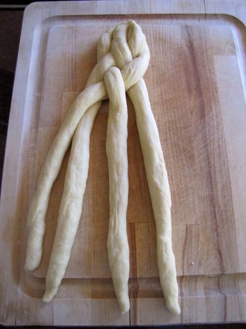

# Challah 

## Ingredients

##### For 1 challah 

* 2 1/4 tsp (1 packet) active dry yeast 
* 1 tsp sugar (for activating yeast)
* 200 grams lukewarm water 
* 82 grams honey or 90 grams sugar
* 1/4 cup vegetable oil 
* 2 large eggs, plus one for egg wash
* 1 1/2 tsp salt
* 450 grams all-purpose flour
* Poppy and/or sesame seeds

## Directions

1. In a large bowl, dissolve yeast and 1 tsp sugar in 200 g water.
2. Whisk oil into yeast, then beat in 2 eggs, one at a time, with remaining sugar and salt. Gradually add flour. When dough holds together, knead by hand or for 3-4 minutes with stand mixer & dough hook on speed 2.
3. Turn dough onto a floured surface and knead until smooth. Clean out bowl and grease it, then return dough to bowl. Cover with plastic wrap, and let rise in a warm place for 1 hour, until almost doubled in size. 
4. Punch down dough, cover and let rise again in a warm place for another half-hour.
5. Braid challah, place on a lined baking sheet, and let rise for another hour. 
6. Preheat oven to 375 degrees.
7. Brush challah with egg wash and sprinkle with seeds.
8. Bake in middle of oven for 35 to 40 minutes, or until golden. 
9. Place on rack to cool. 

##### Note: Challah may be frozen after braiding. Remove from freezer 5 hours before baking.

\columnbreak

# Sourdough Challah

## Ingredients 

##### For 1 challah

### Levain 

- 35 grams (2 tablespoons) sourdough starter
- 80 grams (1/3 cup) warm water
- 135 grams (1 cup) bread flour

### Dough

- Ripened levain 
- 60 grams (1/4 cup) warm water
- 3 large eggs, plus 1 for glazing
- 1 1/2 tsp salt
- 55 grams (1/4 cup) vegetable oil
- 55 grams (3 tablespoons) honey or 60 grams (1/3 cup) sugar
- 400 grams (3 cups) bread flour
- Poppy and/or seseme seeds 

## Directions

1. Knead starter into water until partially  dissolved, then stir in flour. Knead until smooth. Place in sealed container and let ferment at room temperature for 8-12 hours, until tripled in volume.
2. Beat together water, 3 eggs, salt, oil, and honey or sugar until fairly well combined. Add flour and mix until it forms a shaggy ball. Add levain and knead until smooth (no more than 10 minutes by hand). Dough should be very firm, almost like modeling clay. Add water or flour if too dry or wet.
3. Place in a warm covered bowl and let it ferment for about 2 hours. It will probably not rise much, if at all.
4. Divide into two portions and braid. Place braided loaves on lined baking sheets, cover with plastic wrap, & let proof until tripled in size, about 5 hours.
5. 30 minutes before baking, heat oven to 350° F & place rack in upper third position of oven.
6. Beat remaining egg with a pinch of salt. When loaves have tripled and remain indented when gently pressed with a finger, brush with the egg & sprinkle with poppy and/or seseme seeds. 
7. Bake 1-pound (450 g) loaves for 25 to 35 minutes, 1 1/2-pound (680 g) loaf for 35 to 45 minutes, until very well browned. After the first 20 minutes of baking, switch the loaves from front to back so that they brown evenly; if browning too quickly, tent with foil. When done, remove from oven and let cool on a rack.

\columnbreak

# Brading Challah 

## Four-Strand Braid 

1. Create four equal-size strands. Lay strands side-by-side & pinch together at one end.
2. Take the strand **furthest to the right** and weave it towards the left through the other strands, going **over, under, over**.
3. Take the strand **furthest to the right** and repeat the weaving pattern again: **over, under, over**. Repeat this pattern, always starting with the strand furthest to the right, until the whole loaf is braided.
4. Pinch the ends of the loose strands together and tuck them under.

## Six-Strand Braid 

1. Divide dough into 6 balls & roll into strands, about 12 inches long & 1.5 inches wide. 
2. Place strands in a row, parallel to one another, & pinch together at one end. 
3. Move the outside right strand over 2 strands. 
4. Then take the second strand from the left and move it to the far right. 
5. Take the outside left strand and move it over 2. 
6. Move second strand from the right over to the far left. Start over with the outside right strand. 
7. Continue this until all strands are braided, then pinch ends together and tuck them under.
8. For a circular loaf, twist into a circle, pinching ends together. 

## Turban Round 

1. Roll dough into one strand & taper at the ends by rolling the dough between your palms.
2. Roll one end of the strand inward to create a spiral snail-shell shape.
3. Continue rolling the strand in the same direction until the spiral is complete. 
4. Tuck the loose end of the spiral underneath the challah and pinch it tightly into the bottom, securing it.

\columnbreak

