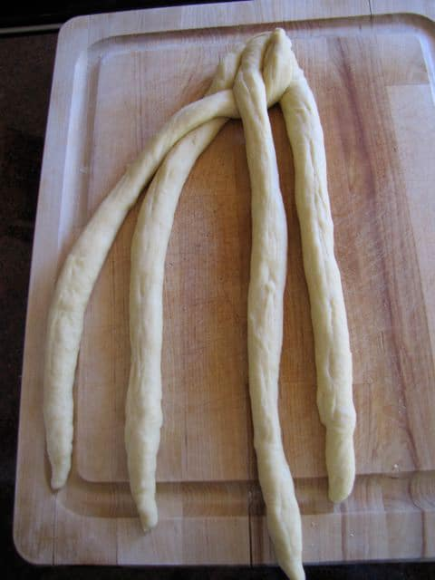

# Challah 

## Ingredients

* 2 1/4 tsp (1 packet) active dry yeast 
* 200 grams lukewarm water 
* 90 grams sugar (or 82 grams honey), plus 1 tsp sugar for yeast
* 1/4 cup vegetable oil 
* 2 large eggs, plus one for egg wash
* 1 1/2 tsp salt
* 450 grams all-purpose flour
* Poppy and/or sesame seeds

## Directions

1. Dissolve yeast and 1 tsp sugar in 200 g water. Whisk oil into yeast, beat in 2 eggs, one at a time, then add salt and remaining sugar or honey. Gradually add flour. When dough holds together, knead for 3-4 minutes with stand mixer on speed 2. Let it rise in an oiled covered bowl at room temperature for 1 hour, until almost doubled. 
2. Punch down dough, cover and let rise again for another half-hour.
3. Preheat oven to 375° F.
4. Braid challah, place on a lined baking sheet, and let rise for another hour. 
5. Brush challah with egg wash and sprinkle with seeds.
6. Bake in middle of oven for 35 to 40 minutes, or until golden. Place on rack to cool. 

\vspace{3mm}

# Sourdough Challah

## Ingredients 

_Levain_

- 35 grams (2 tablespoons) sourdough starter
- 80 grams (1/3 cup) warm water
- 135 grams (1 cup) bread flour

_Dough_

- Ripened levain 
- 60 grams (1/4 cup) warm water
- 3 large eggs, plus 1 for glazing
- 1 1/2 tsp salt
- 55 grams (1/4 cup) vegetable oil
- 55 grams (3 tablespoons) honey or 60 grams (1/3 cup) sugar
- 400 grams (3 cups) bread flour
- Poppy and/or seseme seeds 

## Directions

1. Knead starter into water until partially  dissolved, then stir in flour. Knead until smooth. Place in sealed container and let ferment at room temperature for 8-12 hours, until tripled in volume.
2. Beat together water, 3 eggs, salt, oil, and honey or sugar until combined. Add flour and mix until it forms a shaggy ball. Add levain and knead until smooth. Dough should be very firm, like modeling clay. Let it ferment in a warm covered bowl for ~2 hours. It will probably not rise much.
4. Divide into two portions and braid. Place braided loaves on lined baking sheets, cover with plastic wrap, & let proof until tripled in size, about 5 hours.
5. 30 minutes before baking, heat oven to 350° F.
6. Beat remaining egg with a pinch of salt. Brush challah with the egg & sprinkle with seeds. 
7. Bake for 25-35 minutes. If browning too quickly, tent with foil. When done, place on rack to cool.

\newpage 

# Brading Challah 

## Four-Strand Braid 

1. Create four equal-size strands. Lay strands side-by-side & pinch together at one end.
2. Take the strand **furthest to the right** and weave it towards the left through the other strands, going **over, under, over**.
3. Take the strand **furthest to the right** and repeat the weaving pattern again: **over, under, over**. Repeat this pattern, always starting with the strand furthest to the right, until the whole loaf is braided.
4. Pinch the ends of the loose strands together and tuck them under.

\vspace{4mm}

\vspace{4mm}

## Six-Strand Braid 

1. Divide dough into 6 balls & roll into strands, about 12 inches long & 1.5 inches wide. 
2. Place strands in a row, parallel to one another, & pinch together at one end. 
3. Move the outside right strand over 2 strands. 
4. Then take the second strand from the left and move it to the far right. 
5. Take the outside left strand and move it over 2. 
6. Move second strand from the right over to the far left. Start over with the outside right strand. 
7. Continue this until all strands are braided, then pinch ends together and tuck them under.
8. For a circular loaf, twist into a circle, pinching ends together. 

## Turban Round 

1. Roll dough into one strand & taper at the ends by rolling the dough between your palms.
2. Roll one end of the strand inward to create a spiral snail-shell shape.
3. Continue rolling the strand in the same direction until the spiral is complete. 
4. Tuck the loose end of the spiral underneath the challah and pinch it tightly into the bottom, securing it.

